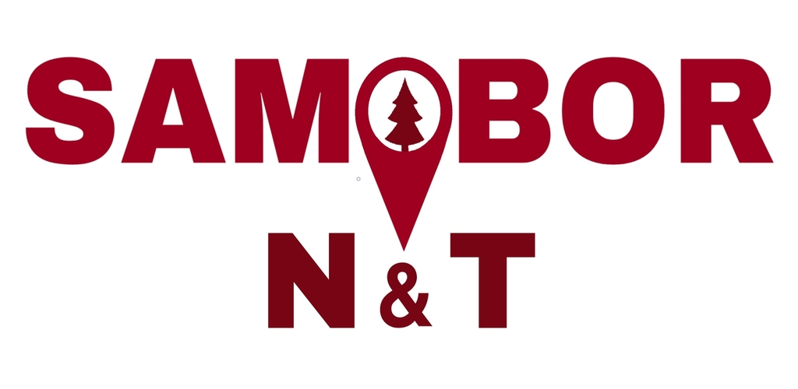

# Samobor N&T

Web App: https://samobornt.web.app 

<b>Description:</b> Application "Samobor N&T" experience Samobor NOW and as it was THEN with each step. App follows you every step of the way as you get to know the picturesque town of Samobor with a simple interface and navigation. The default route leads you through the most interesting sights and when you approach them you get a notification so you can find out more about them in two languages, Croatian and English. Some points also include augmented reality for an even better experience. 
<b>Idea by:</b> School of Economics, Trade and Catering, Samobor 
<b>Created with Partner:</b> Secondary Vocational School, Samobor 
<b>Supported by:</b> Ministry of Tourism and Sports 

## License

This project is licensed under [CC BY-NC-SA 4.0](https://creativecommons.org/licenses/by-nc-sa/4.0/).